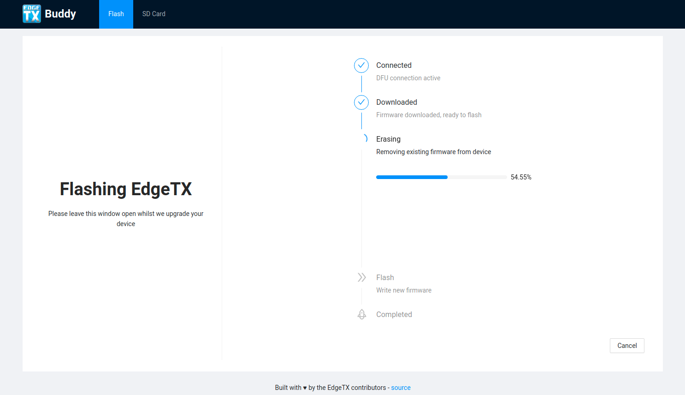

<p align="center">
  

</p>

<p align="center">
  <a href="https://github.com/EdgeTX/buddy/actions">
    
  </a>
  <a href="https://codecov.io/gh/EdgeTX/buddy">
    
  </a>
  <a href="https://github.com/prettier/prettier">
    
  </a>
  <a href="https://app.netlify.com/sites/edgetx-buddy/deploys" >
    
  </a>
  <a href="https://github.com/storybooks/storybook" target="_blank">
    
  </a>
</p>

> Helping you on your journey to EdgeTX

- [Use it online](https://buddy.edgetx.org/)

## Development

### Prerequisites

This application uses `node-usb` when running in electron. In order to compile the bindings
some build libraries are required depending on platform. For MacOS and Windows, these should
already be built in.

Linux

```bash
$ sudo apt-get install build-essential libudev-dev
```

This software is designed to run on `node@16` which can be installed with [`Fast Node Manager`](https://github.com/Schniz/fnm)

### Commands

Enable or install yarn package manager

```bash
# For Node.js <16.10
$ npm i -g corepack

# For Node.js >=16.10
$ corepack enable
```

Install deps

```bash
$ yarn
```

Developing

```bash
# Start electron and web environments in watch mode
$ yarn start

# Start web environment only
$ yarn start:web

# Storybook component environment
$ yarn storybook
```

Building

```bash
# Build and pack electron app (outputs renderer assets too)
$ yarn build

# Compile only web environment
$ yarn compile:web:production
```

Run tests

```bash
$ yarn test
```

Run e2e tests - requires web or app to be built

```bash
# Web app tests
$ yarn e2e:web
# Electron app tests
$ yarn e2e:app
```

Lint

```bash
$ yarn lint:all

# Or yarn lint <file>
```

Format (this codebase has enforced formatting with prettier)

```bash
$ yarn fmt
```

### Structure

The application is split into different contexts

- **Main**: Electron Main Process - initialising the electron application, runs the backend when running in electron. Runs in a Node.JS context
- **Renderer**: React Web Application - Runs in browser or electron renderer process. Shows different UI depending on context.
- **Shared**: Multi-Context code - Designed to run in any environment. Imported by both `Main` or `Renderer`
- **Webworker**: WebWorker Context - `.bootstap` files start-up `.worker` files. Code designed only to run in WebWorker contexts.

### Communication

This application makes use of [`GraphQL`](https://graphql.org/) to request data across process boundary. Meaning that the `renderer` process
is always entirely separated from the GraphQL execution environment.

[Apollo Bus Link](https://github.com/freshollie/apollo-bus-link) is used to facilitate the communication between the GraphQL execution process
in Electron or Webworker environments.

<p align="center">
  
  
</p>

#### Exceptions

Within WebWorker contexts, there are some browser functions which cannot be invoked within WebWorker contexts
and so have to be invoked in the main process. In order to keep things in Electron and Web processes similar
a set of [Cross Boundary Communication](src/webworker/crossboundary) functions have been defined.

## Acknowledgements

A massive thank you to the software which makes all of this possible. Specifically:

- [Flipper Devices](https://flipperzero.one/) for their opensource [DFU library](https://github.com/flipperdevices/webdfu) which runs on [Web USB](https://wicg.github.io/webusb/)
- [Rob Moran](https://github.com/thegecko) for their work on [`node-usb`](https://github.com/node-usb/node-usb) to support WebUSB within Node environments
- [Jimmy Wärting](https://github.com/jimmywarting) for creating a [pollyfill](https://github.com/jimmywarting/native-file-system-adapter) of web filesystem API for Node environments

## Screenshots


